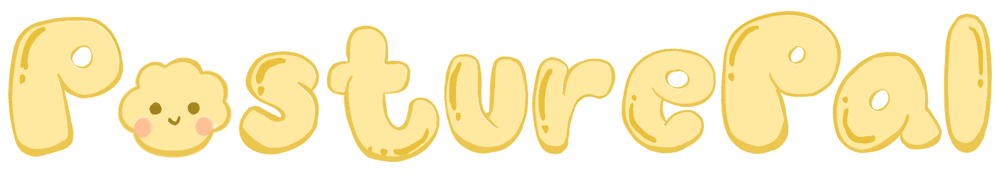

<p align="center">
  
</p>

<p align="center">
  Real-time posture tracking that keeps you sitting smart — at your desk, in any tab.
</p>

<p align="center">
  🌐 <strong>Live app:</strong> <a href="https://PROJECT_ID_REMOVED.web.app">https://PROJECT_ID_REMOVED.web.app</a>
</p>

---

## What it does

PosturePal uses your webcam and MediaPipe pose detection to score your posture in real time. Calibrate once to set your personal baseline, then start a session. PosturePal watches your head position, shoulder alignment, and forward lean — and alerts you the moment your posture slips, even if you're on a different tab.

## Features

- **Real-time pose detection** — webcam overlay with skeleton tracking via MediaPipe
- **Personal calibration** — your score is relative to your own baseline, so camera angle and desk height don't matter
- **Smart alerts** — banner, sound, and OS push notifications fire when you cross your threshold and clear automatically when you recover
- **Background tab support** — detection keeps running at 2fps when you switch tabs
- **Session history** — score trend chart and stats saved per session
- **Leaderboard** — global and friends-only rankings
- **Friends** — send/accept friend requests, see each other's scores
- **Configurable settings** — set your own warning threshold, toggle sound and push notifications

## Tech stack

| Layer | Tech |
|---|---|
| Frontend | React 18, Vite, Tailwind CSS |
| Pose detection | MediaPipe Pose (CDN) |
| Auth & database | Firebase Auth + Firestore |
| Hosting | Firebase Hosting |

## Getting started

**Prerequisites:** Node 18+, a Firebase project, a webcam

```bash
# Install dependencies
npm install

# Start dev server
npm run dev
```

Then open `http://localhost:5173` and sign in.

To connect your own Firebase project, update the config in `src/services/firebase.js` with your project's values from the Firebase console.

## How to use

1. Go to **Dashboard** and wait for pose detection to load
2. Sit up straight in your best posture and click **Calibrate**
3. Click **Start Tracking** — your posture score updates live
4. Adjust your alert threshold and notification preferences in **Settings**

## Project structure

```
src/
├── components/
│   ├── posture/      # CameraView, PostureScore, AlertBanner
│   ├── layout/       # Navbar, Layout
│   └── ui/           # Card, Button, Badge
├── hooks/            # usePosture, useLocalStorage
├── pages/            # Dashboard, History, Leaderboard, Settings, Login
├── services/         # Firebase, posture detection, storage, friends
├── utils/            # Scoring algorithm, formatters
└── context/          # AuthContext
```

## Scoring

Posture is scored 0–100 relative to your calibration snapshot. Five factors are weighted:

| Factor | Weight |
|---|---|
| Head drop (slouching) | 35% |
| Forward lean | 25% |
| Shoulder tilt | 15% |
| Ear/head tilt | 15% |
| Lateral lean | 10% |

A score at or above your configured threshold is good posture. Below it triggers alerts.
